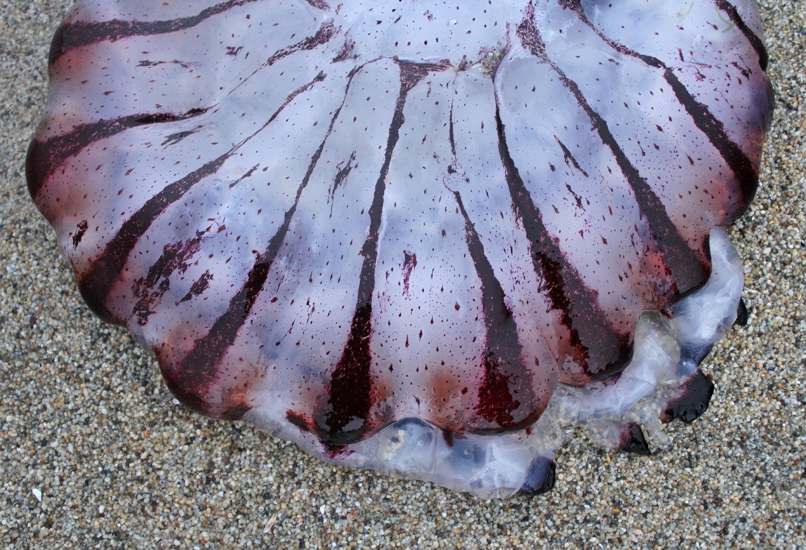

```{r loadlibraries, eval = TRUE, echo = TRUE}
library(rgdal); # spatial/shp reading
library(dplyr); # wrangling data/plotting
library(readr);
library(viridis); # nice color palette
library(sf); # newer "simple features" spatial package
library(USAboundaries); # state/county data
library(Imap); # nice mapping/color functions col.map
library(ggrepel) # for labeling
```



Make a relative link!


### add a photo from a different location than where the Rmd file is


#### Moving on to mapping =====================================

When knitting this chunk will break, because it is looking for the file in the same folder the Rmd file lives. IF your Rmd 

```{r readhShapefileRGDAL}

ogrInfo(dsn="../data", layer="rivs_CA_OR_hydroshed") # see shapefile info

# then read in the shapefile
rivers_sp<- readOGR(dsn = "../data", layer = "rivs_CA_OR_hydroshed") # takes a few seconds!
class(rivers_sp)

```

##

```{r readShapefileSF}

# here package to fix Rmd path issues
library(here)

# probably need two dots:
rivers_sf <- st_read(paste0(here(), "/data/rivs_CA_OR_hydroshed.shp")) # fast!

st_crs(rivers_sf) # check coord ref system

class(rivers_sf) # check data class

library(mapview) # interactive map

# mapview(rivers_sf) # this is big and takes a minute

```

### Get County Data

```{r countyState}

library(USAboundaries)

# Pick a State
state_names <- c("california")

# Download STATE data and add projection
CA<-us_states(resolution = "high", states = state_names)
st_crs(CA)
library(purrr)
# Pick some CA counties
co_names <- c("Butte", "Placer", "El Dorado", "Nevada", "Yuba", "Sierra", "Plumas")

# get COUNTY data for a given state
counties_spec <- us_counties(resolution = "low", states=state_names) %>% # use list of state(s) here
  filter(name %in% co_names) %>% # filter to just the counties we want
  # add centroid values for labels using the geometry column
  mutate(lon=map_dbl(geometry, ~st_centroid(.x)[[1]]), 
         lat=map_dbl(geometry, ~st_centroid(.x)[[2]])) 


```

### Plotting with sf

```{r plottingSFbase}

plot(st_geometry(CA))
plot(CA$geometry, col="red", lwd=4)
#plot(CA)

```

```{r advancedSFbase}
# note adding some alpha adjustment here and using "cex" to make larger
plot(counties_spec$geometry, col=adjustcolor("maroon", alpha=0.5), cex=1.5, axes=TRUE, main="Selected CA Counties")

# now add rivers to existing plot, with add=TRUE
plot(rivers_sf$geometry, col=adjustcolor("blue", alpha=0.7), add=TRUE)

# now add some labels using the centroid lat/long we added earlier
text(counties_spec$lon, counties_spec$lat, labels = counties_spec$name)


```

```{r cropSF}

# crop rivers by counties
rivers_crop <- st_intersection(rivers_sf, counties_spec) # warning is ok

plot(rivers_crop$geometry, col="blue") # a quick plot check to make sure it worked

```

```{r bufferSF}

county_buff <- st_buffer(counties_spec[counties_spec$name=="El Dorado",], dist = .05) # note this is a buffer of decimal degrees


# now plot
plot(counties_spec$geometry, axes=TRUE)
plot(county_buff$geometry, border="maroon", col=adjustcolor("maroon", alpha=0.5), add=TRUE)

```

```{r mapview}

library(mapview)

# basic map
mapview(rivers_crop) + mapview(counties_spec)

# map color to a value
mapview(counties_spec, zcol="aland")


```

To save a mapview map, two options:

 - One is to save from the viewer in RStudio, Export and Save as Webpage
 - using the `mapshot` function in mapview
 
```{r mapshot}


county_mapview_color <- mapview(counties_spec, zcol="aland")

# mapshot(county_mapview_color, url = "count_mapview_color.html")


```

### Using KML files

```{r kml}

suppressPackageStartupMessages({
  library(ggplot2)
  library(dplyr)
  library(sf);
  library(stringi)
  })

# https://waterwatch.usgs.gov/?m=stategage
gages <- st_read(paste0(here(),"/data/streamgages_06.kml")) # reads kml but not kmz


```

```{r cleantext}

# pull out relevant info (remove html tags)
gages$name <- gsub(pattern="<.*?>", "", gages$Name)
gages$details <- gsub(pattern="<.*?>", "", gages$Description)
gages$site_no <- substr(gages$name, start = 1, stop = 8)
gages$site <- substr(gages$name, start = 10, stop = nchar(gages$name))
gages$date_s <- substr(gages$details, start=13, stop=22)
gages$date_e <- substr(gages$details, start=32, stop=nchar(gages$details)-1)
gages <- gages %>% dplyr::select(site_no:date_e)
gages$gageID <- paste0("T", gages$site_no)

# grep all sites with "AMERICAN", "DEER" or "BEAR" in site name
gages_FILTER <- filter(gages, grepl(pattern = "AMERICAN|DEER|BEAR",site))


```

```{r ggplotSF}

ggplot() +
  labs(x="Longitude (WGS84)", y="Latitude",
       title="USGS Gages in CA") + 
  geom_sf(data=gages, col="blue", lwd=0.4, pch=21) +
  theme_bw() +
  geom_sf(data=gages_FILTER, col="orange", size=2.5)

```


### Getting a CSV or X/Y fields into R and in SF format

```{r}

library(sharpshootR)  # CDEC.snow.courses, CDECquery, CDECsnowQuery

data(CDEC.snow.courses)
class(CDEC.snow.courses)

# to make as SF
# Make into a new dataframe
snw <- CDEC.snow.courses

# fix data formats...character/factor/numeric
str(snw)
snw$longitude<-as.numeric(snw$longitude)*-1 # fix longitude, must be negative for northern hemisphere

# make spatial
snw_sf <- st_as_sf(snw, 
                   coords = c("longitude", "latitude"), # can use col names here too, i.e., c("longitude","latitude")
                   remove = F, # don't remove these lat/lon cols from df
                   crs = 4326) # add projection

class(snw_sf)
mapview(snw_sf)


```
